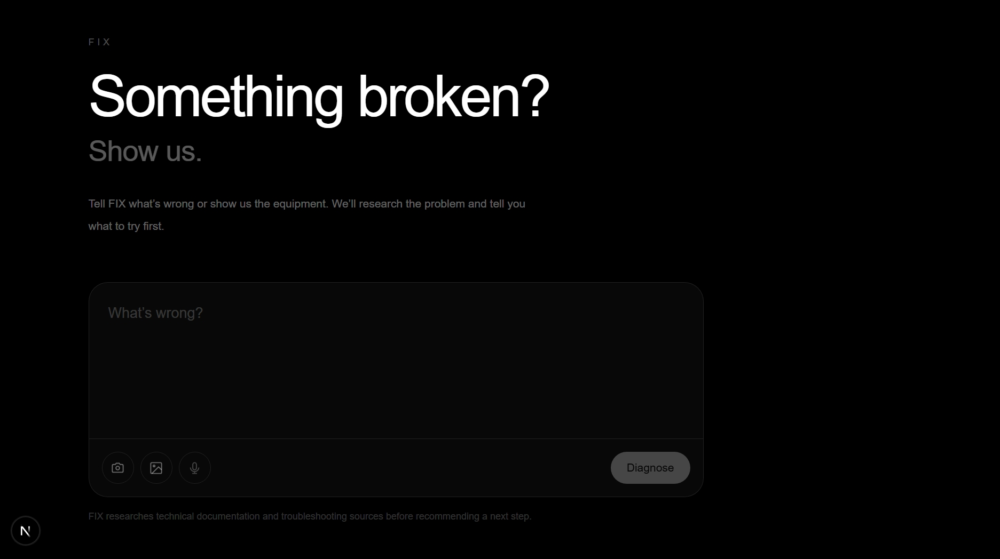
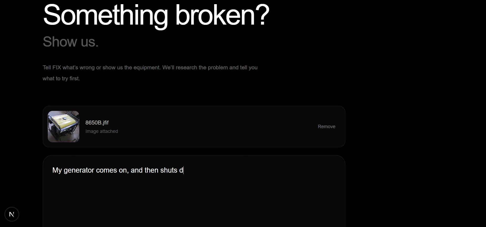
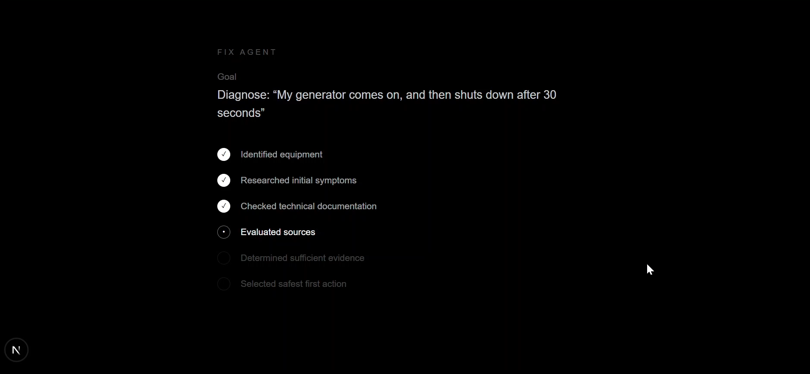
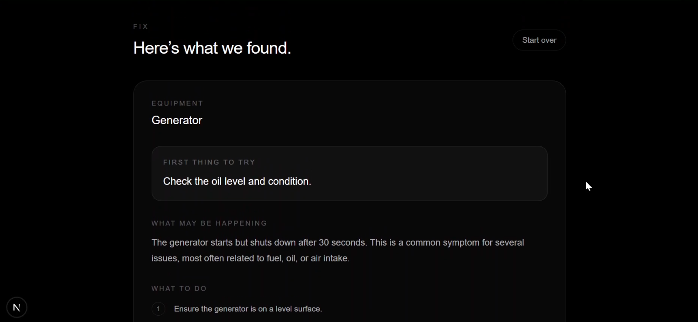

# FIX

### Something broken? Show us.

**FIX is an AI troubleshooting agent for everyday equipment.**

Describe what is wrong. Show FIX the equipment if you have a photo. FIX researches relevant technical information, reasons over the evidence, and gives you a practical first action to try.

[Demo](https://fix.example.com) · [Apify Actor](https://apify.com/) · [GitHub](https://github.com/)

---

## The problem

A broken piece of equipment creates a surprisingly difficult question:

**What do I do next?**

A thermal printer stops printing.

A generator shuts down.

An inverter starts beeping.

A freezer is no longer getting cold.

The information needed to troubleshoot these problems usually already exists. It is scattered across manuals, manufacturer documentation, support pages, repair guides, product pages and forums.

So the person with the problem becomes the researcher.

Search. Open pages. Compare advice. Find the manual. Figure out which model the advice applies to. Decide which recommendation is safe.

And then, after all that, they still have to decide what to try first.

We built FIX to handle that research step.

---

## Why this matters in Nigeria

The problem is particularly meaningful in an economy where small businesses depend heavily on physical equipment.

Nigeria's latest joint NBS/SMEDAN MSME survey reported **39.65 million MSMEs**, with **96.9% classified as micro-enterprises**. MSMEs contributed **46.31% of national GDP** and accounted for **87.9% of employment** in the survey period.

That means equipment problems are not always an inconvenience.

For a small shop, a failed printer can interrupt sales.

For a business relying on refrigeration, a freezer problem can put inventory at risk.

For a business depending on backup power, generator or inverter problems can affect the ability to operate at all.

FIX starts from that reality.

---

## The personal story

FIX started from something much closer to home.

I grew up watching my mother run a small shop.

A lot of the business lived in notebooks, memory and whatever information was available at the moment. Sales had to be tracked. Stock had to be remembered. Customers could owe money. Equipment had to keep working.

The difficult part was not that information did not exist.

It was that running a small business often means having to solve many different problems at once, without a specialist standing beside you.

That experience influenced how I think about software.

The best tool is not necessarily the one with the most features.

It is the one that becomes useful at the exact moment a person needs it.

So with FIX, we asked a simple question:

> **What if troubleshooting could start with showing the problem instead of searching for the answer?**

---

# How FIX works

FIX turns troubleshooting into an agent workflow.

```text
User describes the problem
        ↓
Optional equipment photo
        ↓
FIX identifies useful evidence
        ↓
Researches relevant web sources
        ↓
Evaluates the retrieved information
        ↓
Produces a structured diagnosis
        ↓
Selects the safest first action
        ↓
Shows sources + next steps
```

The important distinction is that FIX is not simply generating an answer from model memory.

**It researches first.**

The model is used to decide what information is needed, interpret visual evidence when available, formulate targeted searches, evaluate retrieved information and turn that evidence into an actionable troubleshooting path.

---

## Built for real equipment problems

The current MVP supports **5 equipment categories**:

* Generators
* Inverters
* Thermal printers
* Freezers
* Refrigerators

The user experience stays broad:

> **Something broken? Show us.**

The backend is deliberately narrower so FIX can build reliable troubleshooting workflows around real equipment categories before expanding further.

---

## Text + image troubleshooting

FIX can work from:

**Text**

> My thermal printer is printing blank receipts.

**Text + image**

> My inverter is showing error code E05 and keeps beeping.

with a photo of the display.

The image is processed in the browser, compressed and kept temporarily in the current session. It is then passed to the FIX Actor for visual analysis.

The image can help FIX identify:

* Equipment type
* Visible model information
* Error codes
* Visible symptoms
* Relevant physical clues

The visual information then becomes another piece of evidence for the research workflow.

---

# The Apify architecture

Apify is not an add-on to FIX.

**FIX itself is an Apify Actor.**

The Actor orchestrates the troubleshooting workflow and can use external research infrastructure to gather fresh information before the AI produces a diagnosis.

The current flow is:

```text
FIX Web App
    ↓
Next.js API
    ↓
FIX Apify Actor
    ↓
AI research planning
    ↓
Apify-powered web research
    ↓
Technical sources
    ↓
AI evidence analysis
    ↓
Structured diagnosis
    ↓
Apify Dataset + Key-Value Store
    ↓
FIX Web App
```

FIX uses:

* **Apify Actors** for execution and research workflows
* **Apify Dataset** for structured diagnosis output
* **Apify Key-Value Store** for live agent progress and final output
* **Apify OpenRouter integration** for Gemini 2.5 Flash
* **Google Search Actor** for targeted external research
* **Crawlee / Apify runtime** for the Actor environment

This is why Apify matters to the product.

Without external information retrieval, FIX would be another chatbot answering from whatever information the model already knows.

With retrieval, FIX can investigate the specific equipment problem before deciding what to recommend.

---

# What a FIX diagnosis contains

A completed run returns structured information including:

```json
{
  "equipment": "thermal_printer",
  "model": "Unknown",
  "confidence": 0.86,
  "summary": "...",
  "likelyIssues": [],
  "firstAction": "...",
  "steps": [],
  "questions": [],
  "parts": [],
  "serviceNeeded": false,
  "sources": []
}
```

The goal is not to overwhelm the user with a technical report.

The most important field is:

### `firstAction`

**What should the user do next?**

For example:

> Check the thermal paper roll and its installation.

The remaining information provides context, possible causes, follow-up questions and the research sources supporting the recommendation.

---

# Run the Actor

FIX can be run directly from the Apify Console or through the Apify API.

## Option 1: Run from the Apify Console

1. Open the FIX Actor on the Apify Store.
2. Click **Try for free** or **Start**.
3. Enter a problem description.
4. Optionally provide the equipment type and model.
5. Optionally provide an image of the equipment.
6. Click **Start**.
7. FIX will:
   - identify the equipment and relevant symptoms
   - plan targeted research
   - retrieve relevant web sources
   - evaluate the evidence
   - generate a structured troubleshooting diagnosis
8. When the run completes, the diagnosis is available in the Actor output and Dataset.

### Example input

```json
{
  "problem": "My thermal printer is printing blank receipts.",
  "equipment": "thermal_printer",
  "model": "",
  "location": "Lagos, Nigeria"
}
````

### Example result

FIX returns a structured diagnosis containing:

* Equipment
* Model
* Confidence
* Summary
* Likely issues
* First action
* Troubleshooting steps
* Follow-up questions
* Parts that may be required
* Whether professional service may be needed
* Research sources

The most important result is the recommended `firstAction`.

For example:

> Check the thermal paper roll and its installation.

---

## Option 2: Run through the Apify API

FIX can also be called programmatically using the Apify API.

Example:

```bash
curl -X POST \
  "https://api.apify.com/v2/acts/YOUR_USERNAME~fix-troubleshooter/runs?token=YOUR_APIFY_TOKEN" \
  -H "Content-Type: application/json" \
  -d '{
    "problem": "My thermal printer is printing blank receipts.",
    "equipment": "thermal_printer",
    "model": "",
    "location": "Lagos, Nigeria"
  }'
```

Replace `YOUR_USERNAME` and `YOUR_APIFY_TOKEN` with your Apify account details.

The returned run ID can then be used to monitor the Actor run and retrieve its Dataset output.

---

## Option 3: Run locally

Clone the repository and install the Actor dependencies:

```bash
git clone https://github.com/gloria2807/fix.git
cd fix/actor/Fix
npm install
```

Set the required environment variables:

```text
APIFY_TOKEN=your_apify_token
```

Then run the Actor:

```bash
apify run
```

For a cloud deployment:

```bash
apify push
```

The Actor can then be run from the Apify Console or through the Apify API.

---

# Web App Demo

FIX also includes a web interface designed to make the troubleshooting workflow simple for everyday users.

The interface lets a user describe a problem and optionally show the equipment with an image.

## 1. Describe the problem



The user starts with a simple question:

> **Something broken? Show us.**

There is no need to understand the underlying research workflow or Apify infrastructure.

---

## 2. Show FIX the equipment



Users can optionally provide a photo of the equipment.

FIX can use the image to identify useful visual information such as:

* Equipment type
* Model information
* Error codes
* Visible symptoms
* Relevant physical clues

The image is compressed in the browser before being sent to the Actor.

---

## 3. FIX researches the problem



After the request is submitted, FIX runs its troubleshooting workflow.

The Actor:

1. Identifies the problem context.
2. Plans targeted research.
3. Retrieves relevant sources.
4. Evaluates the available evidence.
5. Produces the diagnosis.

Progress is stored in the Apify Key-Value Store and surfaced by the web application.

---

## 4. Get a practical first action



Instead of returning a page of search results, FIX presents the most useful starting point:

> **What should I do next?**

The result includes the recommended first action, likely causes, troubleshooting steps, follow-up questions and supporting sources.

Check out the video demo:


---

# Project Links

* **Live Demo:** [https://drive.google.com/file/d/1RmwEqZifbQV1c01rM4IcY1GuF_N8nbdu/view](Demo Video)
* **Apify Actor:** [https://console.apify.com/actors/xb7jVanfooeAYhD03/info/readme?build=latest](Fix: AI Troubshooting Agent)
* **GitHub Repository:** [https://github.com/gloria2807/fix](FIX repo)

---

# Safety is part of the product

FIX is designed around a simple rule:

**Diagnosis should not become dangerous repair advice.**

The system is instructed not to provide hazardous instructions involving areas such as:

* High-voltage electrical systems
* Fuel systems
* Refrigerant systems
* Dangerous electrical repairs
* Other technician-only procedures

When professional service may be required, FIX can say so.

The goal is not to replace technicians.

The goal is to help someone understand the problem and identify a safe place to start.

---

# Why not just use Google?

Google answers:

> **Where is information about this problem?**

FIX is designed to answer:

> **Given this problem, what should I do next?**

That distinction matters.

FIX can:

1. Understand the reported symptom.
2. Inspect an image when available.
3. Determine what information needs to be researched.
4. Search for relevant technical information.
5. Evaluate the retrieved evidence.
6. Produce a structured troubleshooting path.
7. Select one practical first action.
8. Show the sources behind the recommendation.

The user should not have to perform that entire workflow manually.

---

# Why not just use ChatGPT?

General-purpose AI can explain equipment problems.

FIX is built around a different workflow.

**Problem → research → evidence → action.**

It is also packaged as an **Apify Actor**, which means the troubleshooting capability can become part of automated workflows rather than remaining only a consumer chat experience.

A developer could eventually call FIX programmatically, run it as part of an automation, consume its structured dataset output, or build another application around the Actor.

---

# Monetisation

The project follows the central idea of **Ship and Earn Africa**.

FIX is not only a prototype.

It is designed as a product that can be:

* Published on the Apify Store
* Called through the Apify API
* Integrated into other workflows
* Charged per completed troubleshooting event

The monetisation model is **Pay Per Event**.

That means the unit being monetised is not a subscription to a dashboard.

It is the useful outcome:

**a completed troubleshooting diagnosis.**

---

# Current build

| Capability                   | Status |
| ---------------------------- | ------ |
| Apify Actor                  | ✅      |
| Published Actor architecture | ✅      |
| Structured input schema      | ✅      |
| Structured diagnosis output  | ✅      |
| Web research                 | ✅      |
| Technical source retrieval   | ✅      |
| AI research planning         | ✅      |
| AI evidence-based diagnosis  | ✅      |
| Live run progress            | ✅      |
| Dataset output               | ✅      |
| Key-Value Store output       | ✅      |
| Text troubleshooting         | ✅      |
| Image input                  | ✅      |
| Visual analysis              | ✅      |
| Safety constraints           | ✅      |
| Pay Per Event architecture   | ✅      |
| 5 equipment categories       | ✅      |

---

# Technology

### Frontend

* Next.js
* React
* TypeScript
* Tailwind CSS

### Agent

* Apify Actor
* TypeScript
* Apify SDK
* Apify Client

### AI

* Gemini 2.5 Flash
* Apify OpenRouter integration
* Multimodal image analysis

### Research

* Apify Google Search Actor
* Technical documentation
* Manufacturer information
* Troubleshooting resources

### Storage / execution

* Apify Dataset
* Apify Key-Value Store
* Apify cloud runtime

---

# Design principle

FIX follows one product principle:

> **Build vertically on the backend. Stay simple on the frontend.**

A user should not need to know which Actor ran, which search query was generated, which model was used or how the evidence was evaluated.

They should be able to say:

> **Something is broken.**

And get a useful next step.

---

# What's next

The current MVP is deliberately focused.

The next layer of FIX can expand the same workflow into:

* More equipment categories
* Better equipment and model identification
* Deeper conversational diagnosis
* Dynamic follow-up questions
* Parts identification
* Local parts discovery
* Local repair-service discovery
* More visual troubleshooting
* More integrations through the Apify ecosystem

The long-term idea is bigger than a troubleshooting chatbot.

It is a **research-and-action layer for the physical things people depend on.**

---

# Built for Ship and Earn Africa

FIX was built for the **Apify × She Code Africa BuildHer Hackathon 2026**, under the theme **Ship and Earn Africa**.

The challenge was not simply to make a demo.

It was to build something useful, ship it as an Apify Actor and create a path to monetisation.

That is exactly how FIX is being built:

**real problem → working product → Apify infrastructure → published Actor → monetisable event.**

---

## The simplest way to understand FIX

When something breaks, most people don't need another page of search results.

They need to know:

> **What do I do next?**

**FIX.**

### Something broken? Show us.
